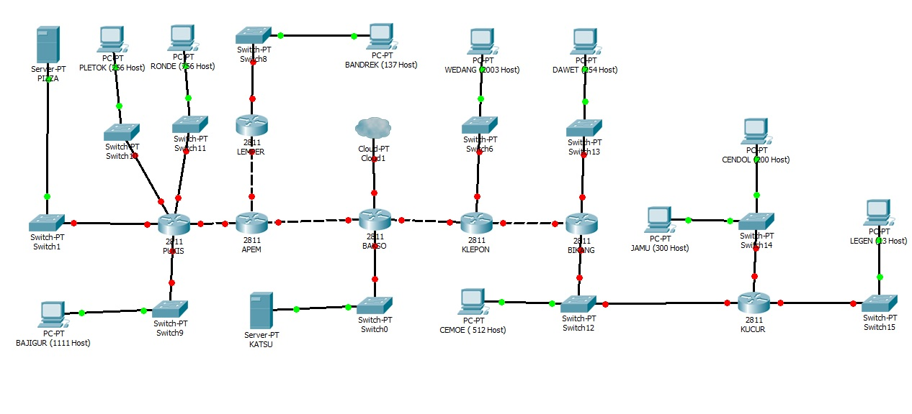

# Soal Shift Modul 4 - Subnetting & Routing

## Catatan
1. Deadline hari **Rabu, 14 November 2018** pukul **22.00**
2. Soal shift dikerjakan pada **Cisco Packet Tracer** dan **UML** menggunakan metode yang **berbeda**.
> **Contoh: di CPT menggunakan VLSM, maka di UML menggunakan CIDR. Sebaliknya juga diperbolehkan.**
3. Soal diatas bersifat **BENAR** dan **DAPAT DIKERJAKAN**. Tidak diperbolehkan bertanya apapun kepada asisten.
4. **CLOUD** diberikan *IP TUNTAP*
5. **Server** diberikan *IP DMZ*
6. Berikan memori sebesar **64MB** pada setiap **UML**
7. Pembagian IP dan routing harus SE-EFISIEN MUNGKIN
8. Pastikan semua UML dapat melakukan ping ke its.ac.id

## Perhatikan Ketika Demo
1. **Perhitungan** subnetting VLSM dan CIDR **_dibawa saat demo_**.
2. File **_.pkt_** dikirim ke email asisten penguji (Daftar asisten penguji keluar hari Selasa, 13 November 2018)
3. **File yang didemokan** adalah file **_.pkt_** yang telah dikirim ke asisten.
4. **Maksimal menghubungi asisten untuk demo hari Rabu, 14 November 2018**
5. **Demo dan revisi** dimulai dari hari **Kamis**, 15 November 2018 sd **Sabtu**, 17 November 2018 pukul **22.00**
6. **Pengurangan nilai** akan dilakukan ketika:
    - **Melanggar** salah satu dari tulisan diatas.
    - **Hasil perhitungan** untuk *VLSM / CIDR*, berbeda dengan di *CPT /UML*
    - **Pembagian IP** kurang efisien
    - **Routing** kurang efisien
    - Tidak bisa **menjelaskan** cara perhitungan VLSM dan CIDR
